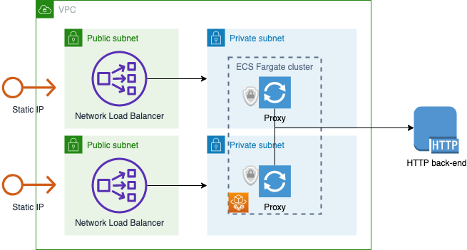

# Nginx Proxy

This module deploys an Nginx reverse proxy in an ECS Fargate cluster.

The goal is to provide a static IP address to external clients, and have that static IP go to some resource inside the AWS environment.  We will terminate SSL on the proxy in case the internal resource does not support SSL.  The classic use case is providing an SSL endpoint for a static web site hosted in an S3 bucket, where we can't use CloudFront because we need a static IP rather than a DNS endpoint.

## Customize

You can customize the Nginx configuration by editing `docker/nginx.conf`.  We use the placeholder `PROXY_FOR` in the `location` directive; we'll substitute your desired target URL at run time.  You can use any other Nginx configuration you like in this file.

Create a file called `local.tfvars`.  You must provide values for:

* `region`: The AWS region you want to deploy in
* `NginxImage`: You will fill this in after you build the Docker image.
* `ProxyFor`: Set this to a URL that Nginx will relay traffic to, for example `https://www.amazon.com`.
* `ingress_cidr`: Set this to a CIDR range for allowed ingress to the NLB.

You can also override any of the defaults in `variables.tf`.

## Build the Nginx image

Build the image with a self-signed cert:

    cd docker
    openssl req -x509 -nodes -days 365 -newkey rsa:2048 -keyout cert.key -out cert.crt
    build_and_push.sh nginx-proxy

You can use a cert from a valid CA instead if you have one available.

Note the value of the Nginx image in ECR, and put this into `local.tfvars` as the `NginxImage` parameter.

## Deploy Terraform

Deploy Terraform:

    cd ..
    tf init
    tf apply -var-file="local.tfvars"
    
You'll get the load balancer endpoint as the output of the stack.

## License

See the LICENSE file in this repo.
